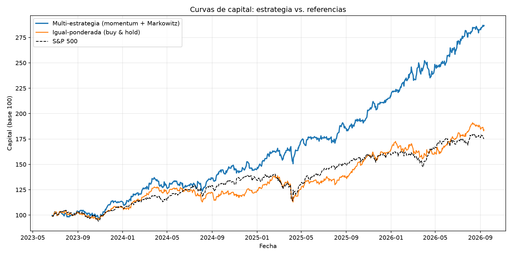
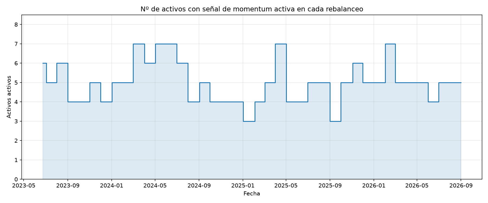

# 🏁 Capstone: Multi-Strategy Portfolio

> Momentum decides *what* to hold; Markowitz decides *how much* of each. A real, monthly-rebalanced backtest that combines two already-built projects into one strategy — the closing piece of the portfolio's first ten projects.


---

## What it does

Combines two projects already built and tested independently into one real trading strategy:

- **Signal (Project 2)**: at each monthly rebalance date, a stock is "active" if its 50-day SMA is above its 200-day SMA (the golden-cross momentum rule) — decides *which* of the 8 stocks are in play.
- **Allocation (Project 9)**: among the active stocks, the maximum-Sharpe (tangency) portfolio decides *how much capital* goes to each — using only the trailing 1-year window of returns available at that point in time, never future data.

The result is backtested month by month over real historical data and compared against two references: an equal-weighted buy & hold of the same 8 stocks, and the S&P 500.

## Why this project is different from the rest of the portfolio

It's the capstone of the first ten projects — the same role Project 5 played for Projects 1-3. It introduces **no new financial model**: `src/strategy.py` contains zero signal logic and zero optimization logic of its own. It loads `signals.py` from Project 2 and `markowitz.py` from Project 9 directly by file path and only adds the orchestration that decides *when* to call each and *how* to combine their outputs. The point being demonstrated is that the rest of the portfolio isn't a collection of disconnected exercises — the pieces compose into something real.

## Dashboard preview

| Equity curves | Active assets over time |
|---|---|
|  |  |

The full interactive version is in [`outputs/dashboard.html`](outputs/dashboard.html): just double-click to open it, no server required.

## Project structure

```
capstone-multi-strategy-portfolio/
├── README.md
├── requirements.txt
├── config/
│   └── multi_strategy.py    <- universe, benchmark, SMA/lookback windows, rebalance frequency
├── data/                    <- cached price snapshots (record, not a read cache)
├── notebooks/               <- Jupyter exploration
├── src/
│   ├── data.py                 <- historical prices, multi-ticker (yfinance)
│   ├── strategy.py               <- loads Project 2 + Project 9 by path; monthly rebalance loop
│   ├── visualize.py                <- static charts (matplotlib): equity curves + active-assets
│   ├── dashboard.py                  <- interactive dashboard (Plotly) -> outputs/dashboard.html
│   └── main.py                         <- orchestrates the pipeline
└── outputs/                 <- generated charts and dashboard
```

## How to run it

```bash
python -m venv venv
source venv/bin/activate  # on Windows: venv\Scripts\activate
pip install -r requirements.txt
python src/main.py
```

On completion, the console prints the comparison table (return, volatility, Sharpe, max drawdown for the strategy and both references) and the last few rebalances' composition, and the following are generated in `outputs/`: `equity_curves.png`, `active_assets.png` and `dashboard.html`.

### A note on SSL certificates
Same mechanism as in the earlier projects: if `yfinance` fails with `CERTIFICATE_VERIFY_FAILED` (typical with antivirus software that inspects HTTPS traffic, e.g. Norton), `src/data.py` automatically uses a local certificate bundle at `.certs/cacert.pem` if present.

## The strategy

On the first trading day of every month:

1. **Signal**: for each of the 8 stocks, check whether the 50-day SMA is above the 200-day SMA, using `moving_averages`, `compute_signal` and `tradeable_signal` from `proyecto-2-momentum-backtest/src/signals.py` unmodified — including its `shift(1)`, which is exactly what prevents look-ahead bias here too (the day-`t` signal only uses information available through the close of `t-1`).
2. **Allocation**, among the active stocks only:
   - 0 active: 100% cash for that month (explicit simplification — assumes 0% return in cash rather than accruing the risk-free rate).
   - 1 active: 100% in that stock (nothing to optimize with one asset).
   - 2+ active: `max_sharpe_portfolio` from `proyecto-9-markowitz-frontera-eficiente/src/markowitz.py`, unmodified, using `mu`/`Sigma` estimated from the trailing 252 trading days *as of that rebalance date only*.
3. Those weights are held fixed until the next rebalance; daily portfolio returns are chained together across the full backtest into one equity curve.

## Results

_(live data — same 8-stock universe as Projects 1/9, ~3 effective years of backtest after a 1-year SMA/lookback burn-in, 40 monthly rebalances)_

| | Annualized return | Annualized volatility | Sharpe | Max drawdown |
|---|---|---|---|---|
| Multi-strategy | +38.2% | 15.6% | 2.45 | -10.1% |
| Equal-weighted (buy & hold) | +21.0% | 15.4% | 1.36 | -18.7% |
| S&P 500 (benchmark) | +19.0% | 14.5% | 1.31 | -18.9% |

## Key findings

- **The drawdown difference is the most economically meaningful number here, not the return**: -10.1% vs. -18.7%/-18.9% — the strategy's ability to *rotate out* of stocks once their momentum signal turns off is what cuts the worst peak-to-trough loss roughly in half, not some return-chasing effect. Similar volatility (15.6% vs. 15.4%) with much better Sharpe and drawdown is exactly the profile a risk-based allocation on top of a trend filter is supposed to produce.
- **The number of active assets varies meaningfully over time (3 to 7 of the 8)**, visible directly in the active-assets chart — the strategy is never fully invested in the whole universe and never fully in cash either, which is the intended middle ground between the two extremes.
- **This backtest ignores transaction costs entirely**, and that's not a minor caveat: monthly rebalancing across up to 8 positions, done for real, would incur trading costs, bid-ask spread, and slippage on every rebalance — the single most common reason a backtest with genuinely good numbers on paper fails to reproduce them in live trading. A more honest version of this project would subtract an assumed cost per trade and see how much of the Sharpe/return edge survives.

## Concepts to be able to explain in an interview

- **Why combine a signal with an optimizer instead of equal-weighting the active names**: an entry/exit rule alone says nothing about *how much* risk each active asset contributes, or how they move together — that's exactly the gap the risk-based allocation step closes.
- **Transaction costs and why paper backtests overstate real returns**: the classic gap between an academic backtest and a tradeable strategy, and why frequency of rebalancing is a direct lever on how much of that gap matters.
- **Look-ahead bias, twice over**: once in the signal (Project 2's `shift(1)`) and once in the allocation (using only the trailing window *as of* the rebalance date, never future returns) — both have to hold for the backtest to mean anything.
- **Why this project reuses code instead of reimplementing it**: `strategy.py` importing `signals.py` and `markowitz.py` by file path is a deliberate choice to demonstrate that the underlying models were already validated in their own projects — re-deriving them here would just be re-testing already-tested code, not adding anything.
